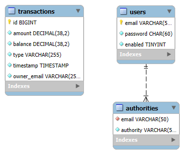
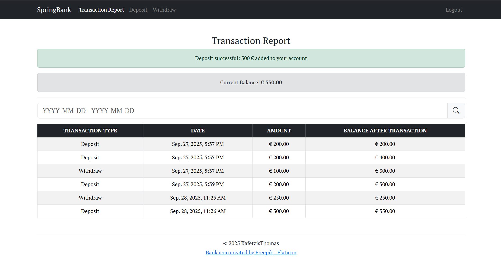
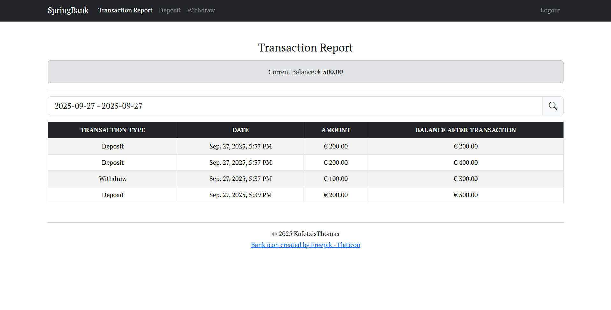

<div align="center">
    
    <p>A simple banking system concept.<br>Written in Java/Spring Boot</p>
</div>

## Features

- Deposit and withdraw money
- View transaction history with an optional date range filter
- See real-time balance updates after each transaction

## Tech Stack

Built with Java 25, Spring Boot, MySQL, Thymeleaf and Bootstrap 5.

## Database Schema



## Setup for Local Development

### Clone the repository

```bash
git clone https://github.com/KafetzisThomas/SpringBank.git
cd SpringBank
```

### Run the SQL scripts to create tables

In MySQL Workbench, open and run the scripts from the `sql-scripts/` directory (user table first, then transaction table).
https://youtu.be/6Td5dbUC4Wg?si=FUFFYj-s0ak8XaQf

If you prefer the CLI, you can use the following commands:
https://youtu.be/gvcBDA2wJJ4?si=o6WndNPOMsMe8G7S

### Rename and configure the application properties file

```bash
cp src/main/resources/application.properties.example src/main/resources/application.properties
```

Edit `application.properties` to update any necessary values (database config).

### Run the application (Tomcat Server)

```bash
mvn spring-boot:run
```

Access web application at http://127.0.0.1:8080 or http://localhost:8080.

## Run Tests

```bash
mvn test
```

Note: Most of these steps can be skipped if you use a full-featured IDE like IntelliJ.

## Demo Images





