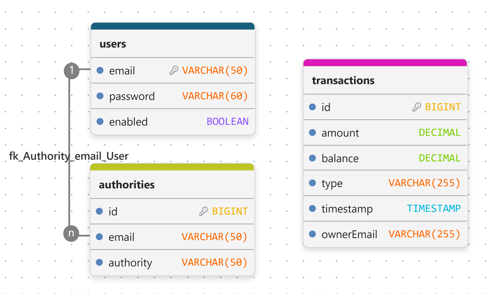
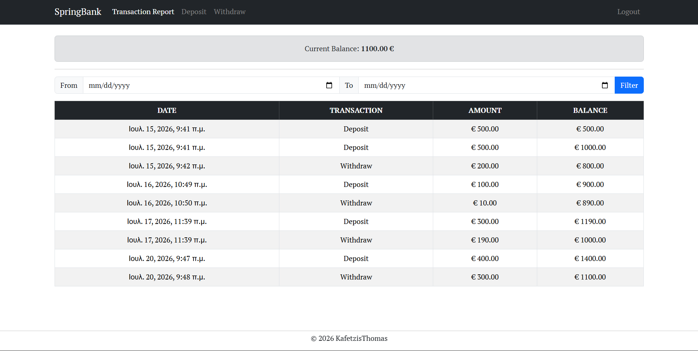
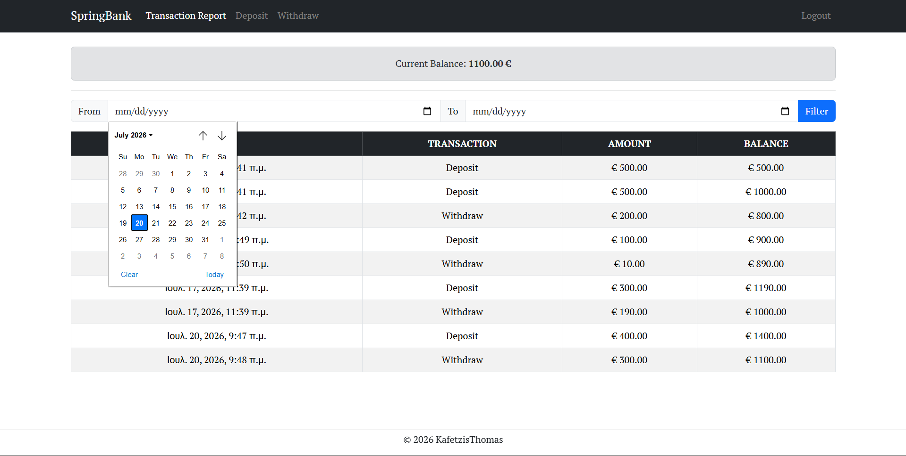
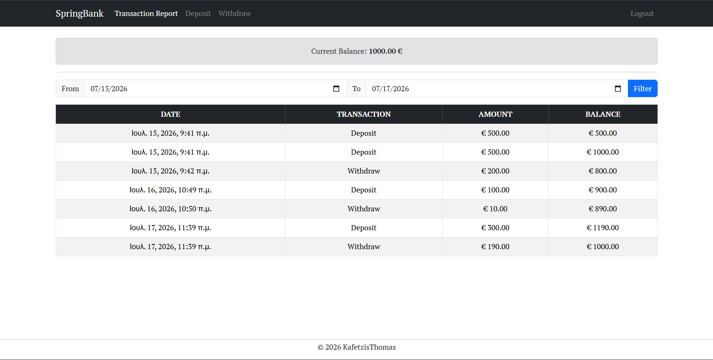
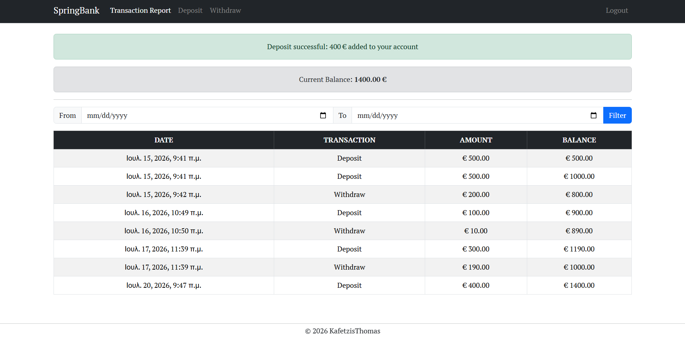
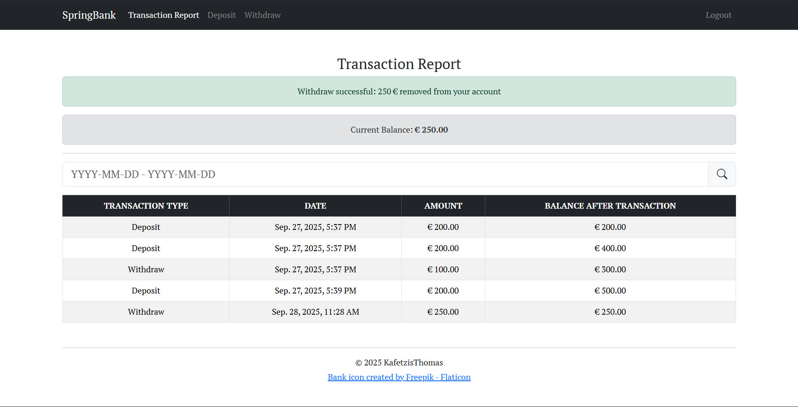

<div align="center">
    
    <p>A simple banking system concept.<br>Written in Java/Spring Boot</p>
    
</div>

## Features

- Make deposits and withdrawals
- View transaction history with date filtering
- Monitor your balance in real time after each transaction

## Tech Stack

Built with Java 25, Spring Boot, PostgreSQL, Thymeleaf and Bootstrap 5.

## Database Schema



## Usage

Start the PostgreSQL database:

```bash
docker compose up -d
```

Run the Spring Boot application:

```bash
# RECOMMENDED: PowerShell/Linux/Mac
./mvnw spring-boot:run

# Windows CMD
.\mvnw.cmd spring-boot:run
```

Access web application at http://127.0.0.1:8080 or http://localhost:8080.

## Run Tests

```bash
./mvnw test
```

## Demo Images










